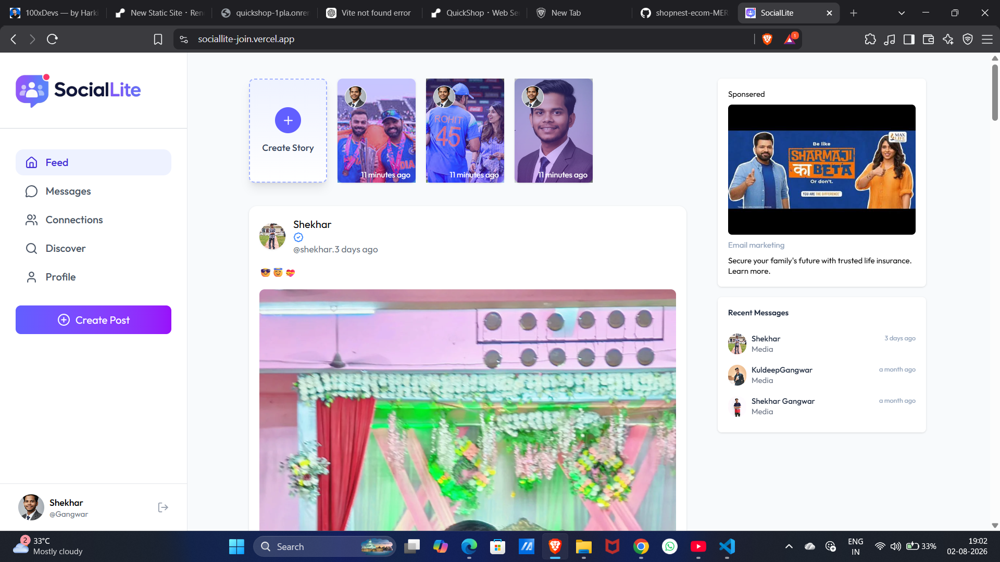
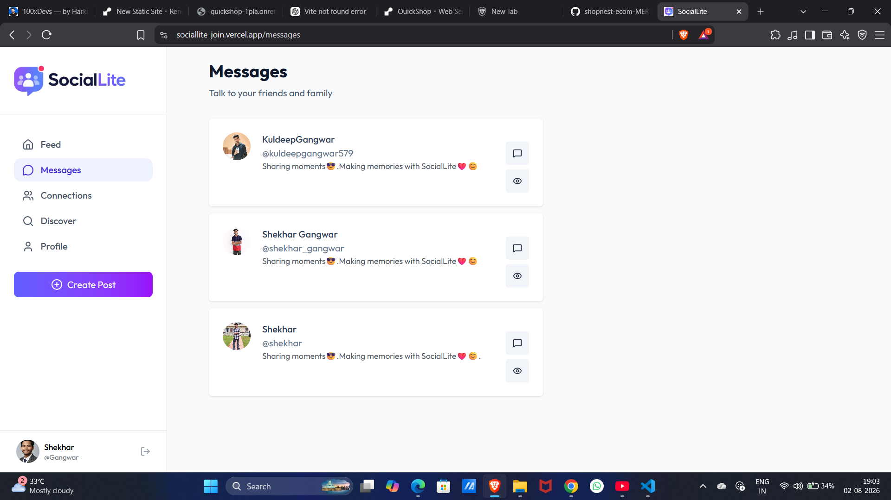
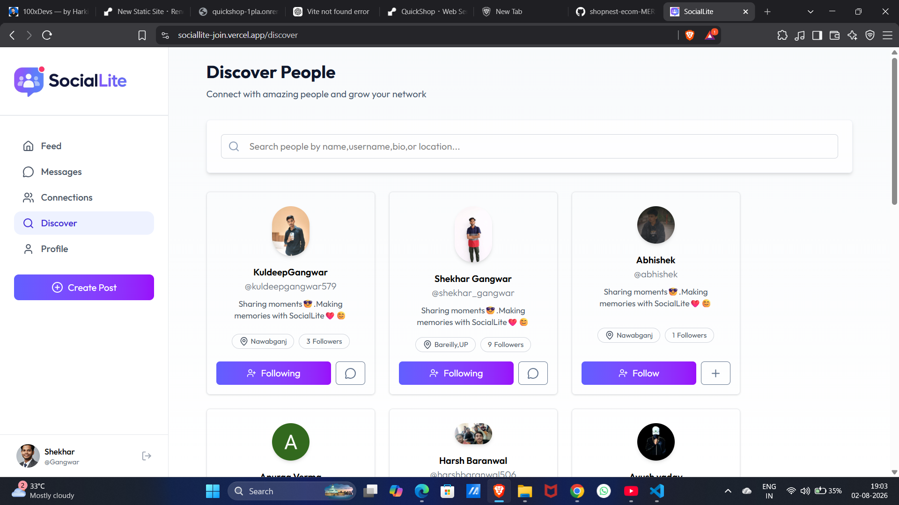
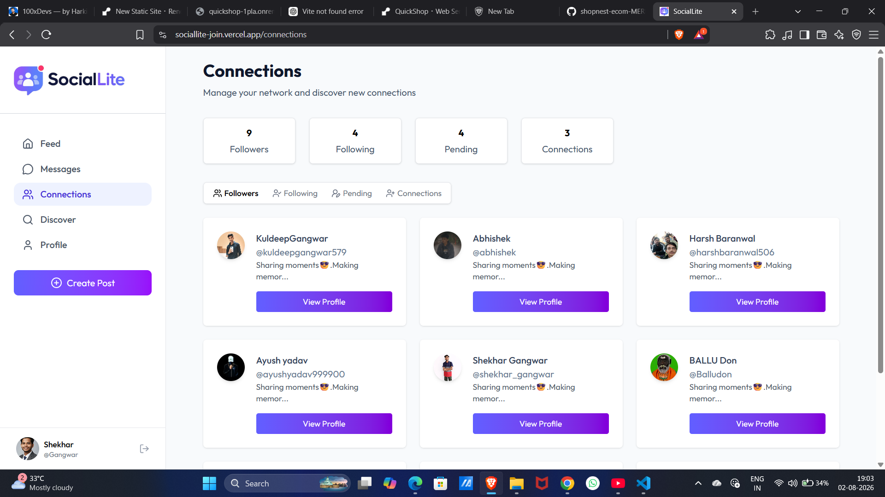
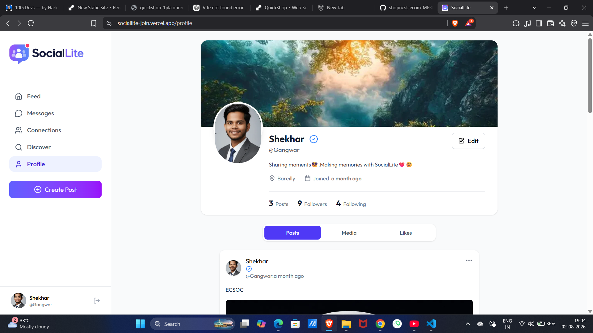

# 🚀 SocialLite - Full Stack Social Media Platform

SocialLite is a modern full-stack social media platform that enables users to connect, share posts, and interact with others through a clean and responsive interface. The application is built using the MERN stack and integrates modern services like Clerk for authentication, ImageKit for media storage, and Brevo for email communication.

## ✨ Features

- 🔐 Secure user authentication and session management using Clerk
- 👤 Create and manage user profiles
- 📝 Create and delete posts
- 🖼️ Upload images with ImageKit integration
- ❤️ Like and unlike posts
- 💬 Comment on posts
- 👥 Follow and unfollow users
- 📧 Email notifications powered by Brevo
- ⚡ Fast and centralized state management using Redux Toolkit
- 🔔 Interactive toast notifications
- 🕒 Human-readable timestamps using Moment.js
- 📱 Fully responsive UI for desktop and mobile devices

---

## 🛠️ Tech Stack

### Frontend
- React.js
- Redux Toolkit
- Tailwind CSS
- React Router DOM
- Axios
- Lucide React
- React Hot Toast
- Moment.js

### Backend
- Node.js
- Express.js
- MongoDB
- Mongoose
- Multer

### Third-Party Services
- Clerk Authentication
- ImageKit
- Brevo

---

## 📂 Project Structure

```
SocialLite
│
├── client
│   ├── src
│   │   ├── api
│   │   ├──  app
│   │   ├── components
│   │   ├──  features
│   │   ├── pages
│   │   └── assets
│   │
│   └── public
│
├── server
│   ├── config
│   ├── controllers
│   ├── middleware
│   ├── models
│   ├── routes
│   ├── inngest
│   └── server.js
│
└── README.md
```

---

## 🔗 Live Demo

👉  https://sociallite-join.vercel.app


## 📖 What I Learned

While building SocialLite, I gained hands-on experience with:

- Building scalable full-stack applications using the MERN stack
- Implementing secure authentication using Clerk
- Managing global state with Redux Toolkit
- Uploading and optimizing images using ImageKit
- Creating RESTful APIs with Express.js
- Designing MongoDB schemas and relationships
- Handling file uploads using Multer
- Integrating third-party APIs like Brevo
- Building reusable React components
- Responsive UI design using Tailwind CSS
- Git and GitHub workflow

---

## 📸 Application Screenshots

<table align="center">
  <tr>
    <td align="center">
      <strong>🏠 Feed</strong><br><br>
      
    </td>
    <td align="center">
      <strong>💬 Messages</strong><br><br>
      
    </td>
  </tr>

  <tr>
    <td align="center">
      <strong>🔍 Discover</strong><br><br>
      
    </td>
    <td align="center">
      <strong>🤝 Connections</strong><br><br>
      
    </td>
  </tr>

  <tr>
    <td colspan="2" align="center">
      <strong>👤 User Profile</strong><br><br>
      
    </td>
  </tr>
</table>


## 👨‍💻 Author

**Shekhar Gangwar**

LinkedIn:linkedin.com/in/shekhar-gangwar-b31908339

---

⭐ If you found this project useful, don't forget to give it a star!
